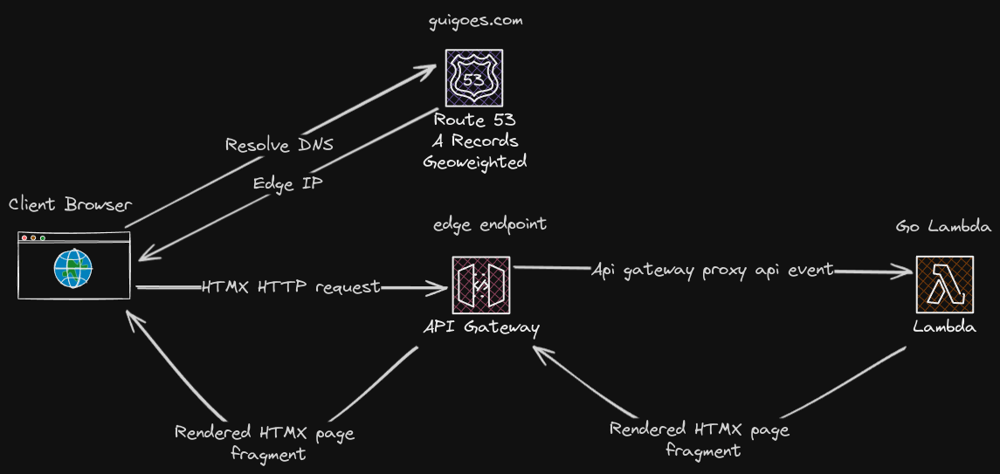
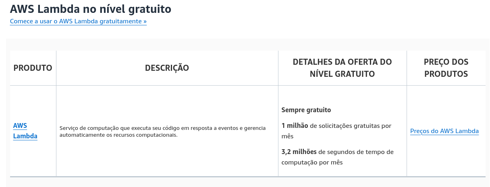
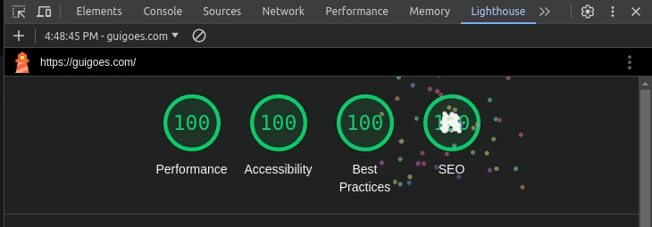
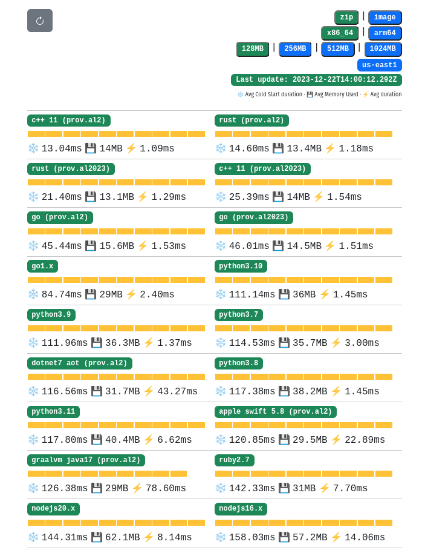
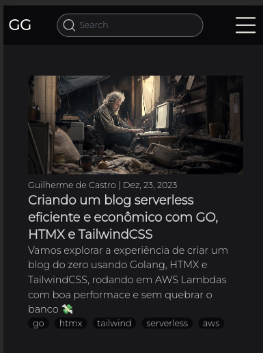
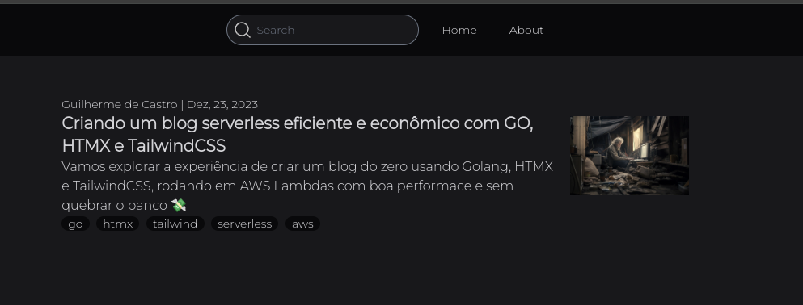

+++
title = "Criando um blog serverless eficiente e econômico com GO, HTMX e TailwindCSS"
date = 2023-12-24T11:06:29-03:00
draft = false
description = "Vamos explorar a experiência de criar um blog do zero usando Golang, HTMX e TailwindCSS, rodando em AWS Lambdas com boa performance e sem quebrar o banco 💸"
author = "Guilherme de Castro"
tags = ["go", "htmx", "tailwind", "serverless", "aws"]
aliases = ["/posts/creating_a_cheap_blog_golang_htmx/"]
cover = "./assets/poor_man_coding.webp"
cover_alt = "Imagem de um homem pobre codando em um computador antigo"
md_cover_position = "0 34%"
+++
Essa é uma stack que recentemente vem ganhando bastante popularidade, principalmente entre os devs que como eu, tem uma carreira mais focada em backend.

Já faz algum tempo que quero construir algo demonstrável usando Go, então resolvi criar esse blog usando essas tecnologias e compartilhar minha experiência na construção desse site, que também já servirá de base para no futuro compartilhar minhas outras empreitadas no mundo do desenvolvimento.

## Requisitos

Quando comecei a implementar o blog, havia alguns requisitos (funcionais e não funcionais) que a implementação final deveria atender:

 - O conteúdo deve ser escrito em markdown e transformado em HTML para ser renderizado no navegador
 - Custo de infra menor possível dentro da minha habilidade
 - Deploy fácil
 - Não precisar lidar com servidores diretamente
 - Site leve, interativo e com bom SEO
 - Estilização ao meu gosto pessoal (gótico minimalista)
 - Responsivo a diferentes tamanhos de tela (boa leitura em mobile e desktop) 
 - Busca full-text dos conteúdos

Para atender esses requisitos esses são os components mais importantes usados na implementação:

1. Go
    - [Templ](https://templ.guide/) - Linguagem de para construção de templates
    - [Gin](https://gin-gonic.com/) - Web framework
    - [Bleve](https://blevesearch.com/) - Indexação e pesquisa full-text
    - [AWS Lambda Go API Proxy](https://github.com/awslabs/aws-lambda-go-api-proxy/tree/master) - Adapter para eventos do AWS API Gateway para requisições válidas do web framework
    - [Goldmark](https://github.com/yuin/goldmark) - Parser de markdown para HTML
2. [HTMX](https://htmx.org/) - Biblioteca de JavaScript que facilita [HATEOAS](https://en.wikipedia.org/wiki/HATEOAS)
3. [TailwindCSS](https://tailwindcss.com/) - Framework CSS
4. AWS
    - [API Gateway](https://aws.amazon.com/pt/api-gateway/) - HTTP Proxy gerenciado
    - [Lambda](https://aws.amazon.com/pt/lambda/pricing/) - Runtime para várias das linguagens mais populares que abstrai o servidor
    - [CDK](https://aws.amazon.com/pt/cdk/) - Kit de desenvolvimento para a nuvem da Amazon que permite declarar e provisionar recursos usando C#, Go, Java, JavaScript, Python e TypeScript 

## Overview da arquitetura



A arquitetura do blog em sí é bastante simples, parte do trabalho fica no API Gateway que recebe as requisições HTTP e invoca a Lambda com um evento do tipo [Proxy Integration](https://docs.aws.amazon.com/apigateway/latest/developerguide/set-up-lambda-proxy-integrations.html#api-gateway-simple-proxy-for-lambda-input-format).

Já a Lambda que recebe o evento do API gateway usa um [adapter](https://pkg.go.dev/github.com/awslabs/aws-lambda-go-api-proxy@v0.16.0/gin) que transforma o evento em algo que o web framework usado nesse projeto ([Gin](https://gin-gonic.com/)) consegue entender, as rotas do serviço ficam descritas dentro do programa Go que executa na função Lambda.

### Ineficiências

O API Gateway repassa todas as requisições do domínio para a função lambda de forma indiscriminada, mesmo de rotas que não existem. Isso na prática quer dizer que a função vai executar mesmo que seja só para responder com ```404 - Not Found```, ainda não encontrei uma boa maneira de replicar minha definição de rotas no web framework para rotas disponíveis no proxy para evitar execuções desnecessárias.

## Critérios da escolha da stack

### Orçamento

Funções lambda são baratas em pequena escala, inclusive, se sua aplicação gerar um tráfego menor que um [1 milhão de requisições por mês é de graça 🤑](https://aws.amazon.com/pt/pm/lambda/)



Além disso Lambdas tem duas classes de armazenamento por padrão:

**Persistente:** Diretório ```/opt``` que é somente-leitura onde o conteúdos estáticos podem existir. Essa classe de armazenamento pode crescer até 75 GB e persiste entre execuções.

**Temporário:** Diretório ```/tmp```  que permite escritas. Essa classe de armazenamento começa em 512 MB e pode ser configurada para até 10 GB. Como o nome sugere, esse armazenamento existe somente durante a execução da lamba, tudo que existe nele é descartado quando a lambda termina.

Para esse site usarei a menor lambda disponibilizada pela AWS

|RAM   |Ephemeral storage|
|------|-----------------|
|128 MB|512 MB           |


### Frontend rico em interações, com bom SEO e sem penalizar o navegador dos leitores:
 
Para esse fim escolhi a biblioteca [HTMX](https://htmx.org/), é bem compacta (≈ 14kb).

HTMX estende as funcionalidades básicas do HTML e dá acesso a funcionalidades como AJAX, SSE e WebSockets para qualquer elemento nos documentos de hipertexto.

```html
<script src="https://unpkg.com/htmx.org@1.9.10"></script>

<!-- Um botão que não está associado a nenhum form pode 
realizar uma requisição HTTP!!! -->
<button hx-post="/clicked" hx-swap="outerHTML">
Enviar
</button>
```

A renderização das páginas acontece no backend, então páginas estiverem bem configuradas os os buscadores terão facilidade em rastrear e indexar o blog.

O documento final renderizado no navegador é praticamente um HTML estático, sem dependência de estado armazenado no navegador e executando muito pouco JavaScript o que garante uma boa performance.

[^1]
[^1]: Relatório da ferramenta Lighthouse do Google Chrome

Além disso HTMX permite realizar update parcial das páginas com fragmentos de HTML, isso reduz dramaticamente o tamanho das respostas do servidor e elimina a necessidade de recarregar a página inteira para navegar no site.

### Backend

HTMX não tem opiniões sobre qual linguagem usar no backend, então é possível usar qualquer uma das linguagens suportadas na AWS Lamba. A escolha de golang é mais pessoal do que qualquer coisa, mas mesmo assim, há algumas vantagens em usar Go com HTMX:

 1. Baterias incluídas: A biblioteca padrão do go já vem com a maior parte dos pacotes necessários para criar um web server;
 2. Templates: O pacote padrão [html/template](https://pkg.go.dev/html/template) facilita muito a renderização de templates HTML, mas há uma opção ainda melhor que é a biblioteca [templ](https://templ.guide/) que permite criar templates com checagem estática de tipos;
 3. Go compila rápido: Velocidade para realizar mudanças no código;
 
 E o mais importante para os leitores desse blog, Go tem um dos melhores cold starts e uso de memória em AWS Lambdas, perdendo somente para linguagens sem garbage collector como Rust e C++:

[^2]
[^2]: Análise diária de cold start de várias runtimes suportadas em AWS Lambda @ https://maxday.github.io/lambda-perf/

Isso garante uma ótima performance no carregamento das páginas do blog e baixo investimento de minha parte na infraestrutura do site, win win!

### Estilização

TailwindCSS provê ótimos primitivos para a estilização de web app, especialmente facilitadores para a construção de um design responsivo onde existem mudanças dramáticas na interface dependendo do tamanho da tela do dispositivo.

O código a seguir é um documento HTML da página principal que vai listar todos os posts (com elementos sintaxe da linguagem de templates templ):

```html
<!--Elemento da home page-->
<!--todas as classes css são providas pelo tailwind-->
<div class="flex flex-col">
    <!--breakpoint md: @media (min-width: 768px) { ... }-->
    <!--altera o layout para reorganizar os elementos a depender do tamanho da tela-->
    <div class="flex flex-col md:flex-row-reverse md:items-center">
        <a href={ templ.URL(post.Dir) } hx-get={ post.Dir + "?fragment=1" } class="mb-2 max-h-[160px] md:max-h-[210px] md:mb-0 md:ml-[10px]" hx-target="#main">
            
        </a>
        <div>
            //post date
            <div class="text-sm font-thin">{ post.Metadata.Author } | { LocalizeTime(post.Metadata.CreatedAt, is.Language) }</div>
            //post title
            <div class="mb-[3px">
                <h2 class="font-black cursor-pointer">
                    <a href={ templ.URL(post.Dir) } hx-get={ post.Dir + "?fragment=1" } hx-target="#main">{ post.Metadata.Title }</a>
                </h2>
            </div>
            //post description
            <div class="text-base">
                <p class="cursor-pointer">
                    { post.Metadata.Description }
                </p>
            </div>
        </div>
    </div>
    <div class="text-sm font-thin">
        for _, tag := range post.Metadata.Tags {
            //post tags
            <span class="mr-[5px] rounded-full bg-zinc-950 px-[8px]">{ tag }</span>
        }
    </div>
</div>
```

No mobile a interface deve ser apresentada assim:



Já telas maiores que 768px:



### Deploy fácil com CDK

O CDK aqui tem multifunções

1. Definir a infraestrutura
2. Empacotar o binário que vai ser executado na Lambda 
3. Empacotar o conteúdo estático do site e os indices de busca full text
4. Realizar deploy na conta AWS

```golang
package main

import (
	"github.com/aws/aws-cdk-go/awscdk/v2"
	"github.com/aws/aws-cdk-go/awscdk/v2/awsapigateway"
	"github.com/aws/aws-cdk-go/awscdk/v2/awslambda"
	"github.com/aws/aws-cdk-go/awscdk/v2/awss3assets"
	"github.com/aws/aws-cdk-go/awscdklambdagoalpha/v2"

	"github.com/aws/constructs-go/constructs/v10"
	"github.com/aws/jsii-runtime-go"
)

type CdkStackProps struct {
	awscdk.StackProps
}

func GuigoesCdkStack(scope constructs.Construct, id string, props *CdkStackProps) awscdk.Stack {
	var sprops awscdk.StackProps
	if props != nil {
		sprops = props.StackProps
	}

	stack := awscdk.NewStack(scope, &id, &sprops)

    //Compila e empacota o binário da função lambda
	lambda := awscdklambdagoalpha.NewGoFunction(stack, sptr("GuigoesLambda"), &awscdklambdagoalpha.GoFunctionProps{
		Runtime: awslambda.Runtime_GO_1_X(),
		Entry:   sptr("../../cmd/lambda/main.go"),
		Environment: &map[string]*string{
			"POSTS_PATH":     sptr("/opt/posts/"),
			"DIST_PATH":      sptr("/opt/web/dist"),
			"BLEVE_IDX_PATH": sptr("/opt/blog.bleve"),
		},
	})

    //Empacota tudo exceto o que está explicitamente excluído em uma lambda layer acessível no diretório /opt
	postsLayer := awslambda.NewLayerVersion(stack, sptr("GuigoesLayer"), &awslambda.LayerVersionProps{
		Code: awslambda.AssetCode_FromAsset(sptr("../../"), &awss3assets.AssetOptions{
			Exclude: &[]*string{
				sptr("cmd"),
				sptr("deployments"),
				//[..] O resto da lista foi omitido para melhorar a leitura
			},
		}),
	})

	lambda.AddLayers(postsLayer)

    //Cria o http proxy que repassa todas requisições para a lambda
	api := awsapigateway.NewLambdaRestApi(stack, sptr("GuigoesApi"), &awsapigateway.LambdaRestApiProps{
		Handler:          lambda,
		BinaryMediaTypes: &[]*string{sptr("*/*")},
	})

    //Imprime ao final da execução propriedades dos recursos definidos na stack
	awscdk.NewCfnOutput(stack, sptr("api-gateway-endpoint"),
		&awscdk.CfnOutputProps{
			ExportName: sptr("API-Gateway-Endpoint"),
			Value:      api.Url()})

	return stack
}

//[..] Funções utilitárias omitidas

func main() {
	defer jsii.Close()
	app := awscdk.NewApp(nil)
	GuigoesCdkStack(app, "GuigoesStack", &CdkStackProps{
		awscdk.StackProps{
			Env: env(),
		},
	})
	app.Synth(nil)
}

func env() *awscdk.Environment {
	// If unspecified, this stack will be "environment-agnostic".
	// Account/Region-dependent features and context lookups will not work, but a
	// single synthesized template can be deployed anywhere.
	//---------------------------------------------------------------------------
	return nil
}

```

Para realizar o deploy de uma nova versão é só executar o comando ```$ cdk deploy```, se a máquina tiver credencias AWS válidas e com as permissões adequadas o deploy deve acontecer sem problemas.

No futuro pretendo separar o deploy de conteúdo estático do binário, enquanto o projeto é pequeno funciona Ok (por volta de um minuto), mas a medida que os assets forem acumulando tende a demorar cada vez mais.

Fora da possibilidade de eu realizar deploy de uma versão quebrada da aplicação sem querer, quando na verdade só queria escrever um blog post. Bom, conteúdo para uma próxima!

## Conclusão

Golang + HTMX me parece ser ótimo para criar uma webapp leve sem abrir mão da interatividade que é esperada de sites modernos, como o conteúdo é na sua maior parte HTML puro, o suporte nos mais diversos navegadores vem de graça, além da performance.

Falando em performance, ela é dependente somente de quão rápido seu servidor consegue renderizar HTML somado com a latência da rede, nesse exemplo as condições são ideais para boa performance, o conteúdo é lido diretamente do sistema de arquivos e sofre poucas alterações. Em aplicações integradas com banco de dados e/ou APIs, o tempo final para entrega do documento HTML renderizado pelo servidor deve aumentar significativamente, mas até ai, isso também é verdade para uma API que serve JSON ou XML.

O servidor precisa estar sempre alcançável para renderizar as páginas, então se você precisa servir algum tipo de funcionalidade offline HTMX não vai te ajudar 😢.

Caso você já tenha um API pronta com os recursos em algum formato de transporte popular com JSON, um framework que renderiza do lado do client parece ser uma melhor pedida ao invés de HTMX, vejo duas saídas caso quisesse MESMO usar HTMX nesse cenário:

1. Criar rotas específicas para lidar somente com as request HTMX na sua aplicação pré existente, acho que seria um pesadelo tentar misturar num mesmo recurso da API a geração de um formato de transporte como JSON como um formato de "apresentação" como HTML, são dois mundos bem distintos que não deveriam se misturar.

2. Criar um segundo serviço *renderer* que consome a API e renderiza HTML, nesse caso teria que levar a consideração a latência de rede adicional da comunicação do *renderer* com API. Há também um distanciamento da fonte de dados original, você só conseguiria gerar páginas tão boas quanto os dados providos pela API.

Nenhuma dessas opções me parece ideal, acho que React, Vue, Angular e frameworks parecidos seriam seriam uma solução mais direto ao ponto.

Para finalizar, o código do blog é aberto, se te interessou vai lá, dá uma fuçada e deixa uma 🌟:
https://github.com/guilycst/guigoes
